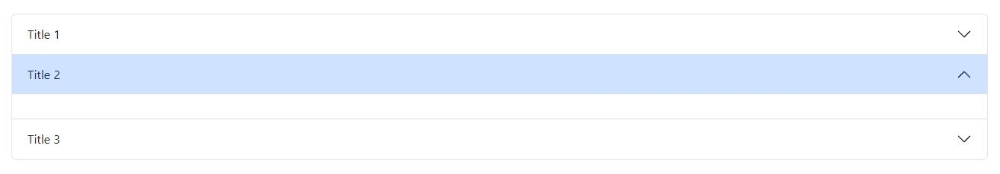

## Description

A simple bootstrap accordion item



```twig
{{ component('proglab_accordion_item', {
    id: 'item1',
    title: 'title1',
}) }}
```
## Parameters

| Parameter | Type      | Description   | Default Values | Valid Values |
|:----------|:----------|:--------------|:---------------|:-------------|
| `id`      | `string`  | **Required**  |                |              |
| `title`   | `string`  | The title     |                |              |
| `open`    | `bool`    | Open the item | false          | true, false  |


## Usage/Examples

```twig
{{ component('proglab_accordion_item', {
    test: 'Done',
    style: 'success'
}) }}
```

```twig
<twig:proglab_accordion_item id="proglab1" title="Title 1">
</twig:proglab_accordion_item>
```

:::info
Put it inside an [accordion](./Accordion.md) !

```twig
<twig:proglab_accordion id="proglab">
    <twig:proglab_accordion_item id="proglab1" title="Title 1">
    </twig:proglab_accordion_item>
    <twig:proglab_accordion_item id="proglab2" title="Title 2" open>
    </twig:proglab_accordion_item>
    <twig:proglab_accordion_item id="proglab3" title="Title 3">
    </twig:proglab_accordion_item>
</twig:proglab_accordion>
```
:::